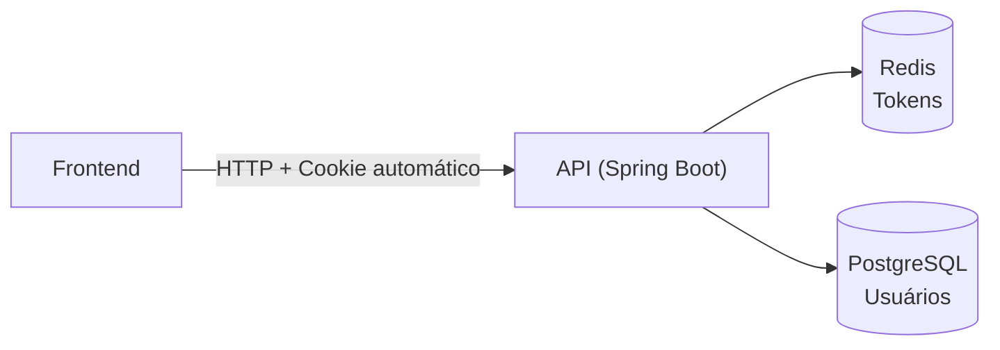
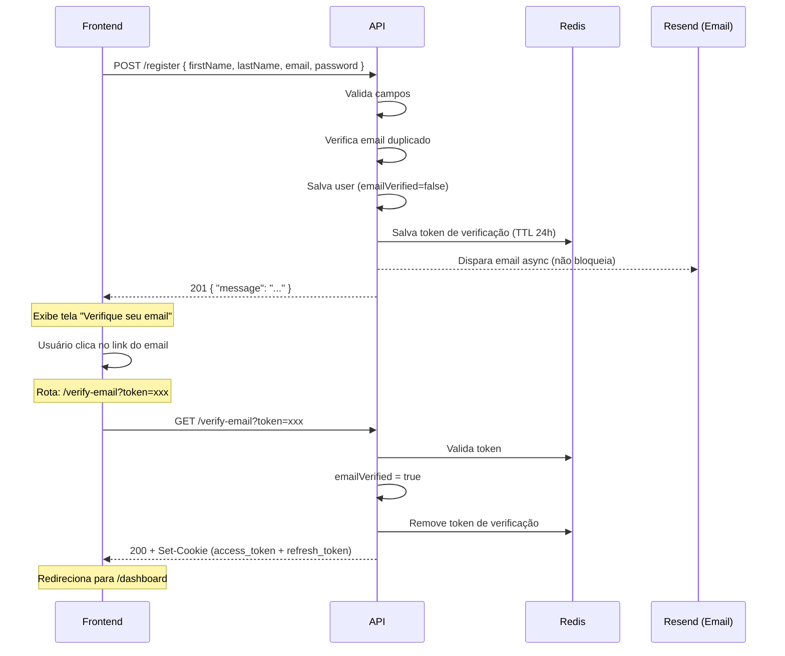
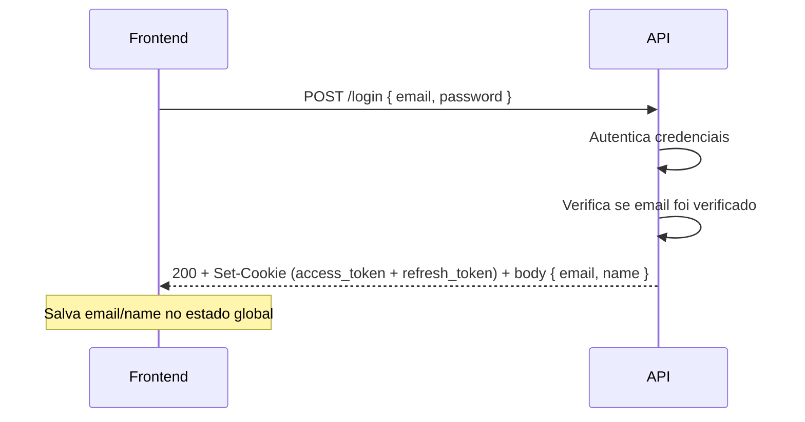
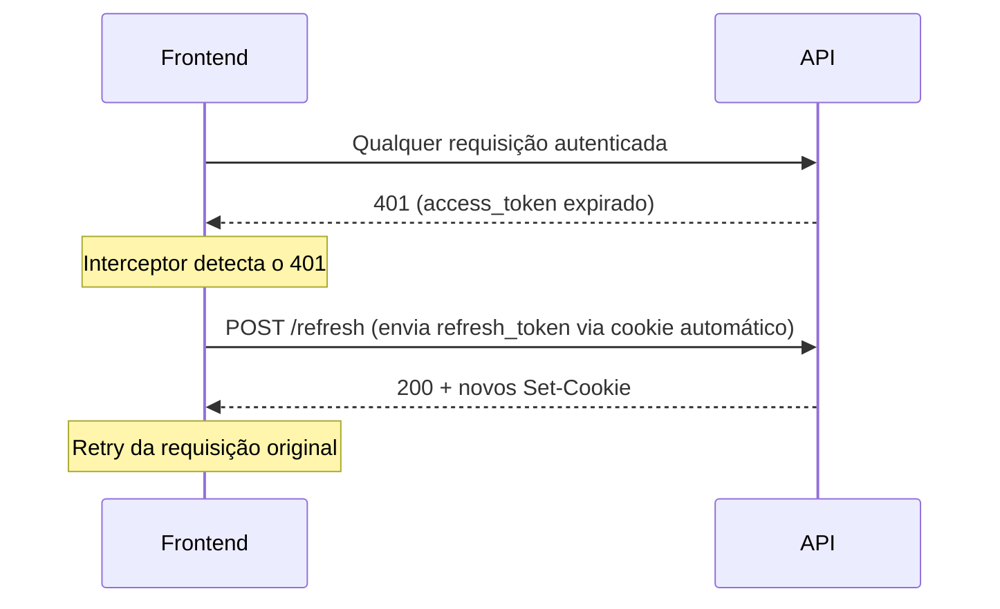
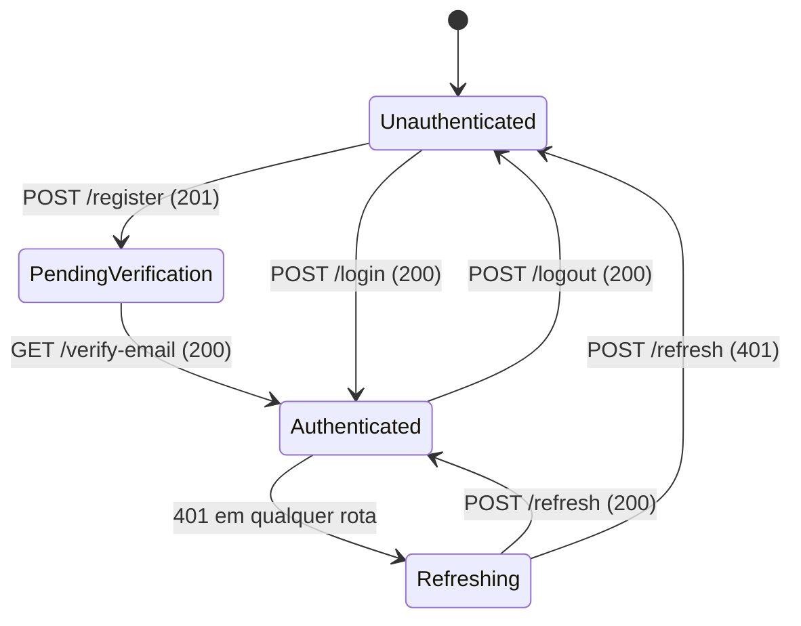

# Authentication Flow — TSM Atelier API

> **Base URL:** `http://localhost:8080/api/v1/auth`

---

## Overview

A autenticação usa **JWT via cookies HttpOnly**, o que significa que o frontend **nunca acessa os tokens diretamente via JavaScript**. Os cookies são gerenciados automaticamente pelo browser em cada requisição.



| Token | Onde fica | TTL | Path |
|---|---|---|---|
| `access_token` | Cookie HttpOnly, Secure | **15 minutos** | `/` |
| `refresh_token` | Cookie HttpOnly, Secure | **7 dias** | `/api/v1/auth` |

> [!IMPORTANT]
> Ambos os cookies têm `HttpOnly=true` e `Secure=true`. O frontend **não consegue lê-los via `document.cookie`** — isso é intencional por segurança. Basta fazer as requisições normalmente com `credentials: 'include'`.

---

## 1. Registro

### Fluxo



### `POST /register`

**Request:**
```json
{
  "firstName": "Maria",
  "lastName": "Silva",
  "email": "maria@email.com",
  "password": "minhasenha123"
}
```

| Campo | Tipo | Regras |
|---|---|---|
| `firstName` | string | obrigatório, 3–50 caracteres |
| `lastName` | string | obrigatório, 3–50 caracteres |
| `email` | string | obrigatório, formato de email válido |
| `password` | string | obrigatório, 6–30 caracteres |

**Response `201 Created`:**
```json
{
  "message": "Registration successful. Please check your email to verify your account."
}
```

> [!NOTE]
> Nenhum cookie é setado neste momento. O JWT só é emitido após a verificação de email.

---

### `GET /verify-email?token={token}`

Chamado pelo frontend quando o usuário clica no link do email de verificação.

**Request:** Sem body. O token vem como query parameter.

```
GET /api/v1/auth/verify-email?token=550e8400-e29b-41d4-a716-446655440000
```

**Response `200 OK`:**
```
Set-Cookie: access_token=eyJ...; HttpOnly; Secure; SameSite=Lax; Path=/; Max-Age=900
Set-Cookie: refresh_token=uuid; HttpOnly; Secure; SameSite=Lax; Path=/api/v1/auth; Max-Age=604800
```

Body vazio. Os cookies são setados automaticamente.

**Como implementar no frontend:**

```typescript
// Rota: /verify-email
const params = new URLSearchParams(window.location.search);
const token = params.get('token');

if (!token) {
  // redireciona para /login com erro
  return;
}

try {
  await fetch(`/api/v1/auth/verify-email?token=${token}`, {
    method: 'GET',
    credentials: 'include', // essencial para receber os cookies
  });
  // sucesso: redireciona para /dashboard
  router.push('/dashboard');
} catch {
  // token inválido/expirado: exibe erro
}
```

---

## 2. Login

### `POST /login`



**Request:**
```json
{
  "email": "maria@email.com",
  "password": "minhasenha123"
}
```

**Response `200 OK`:**
```json
{
  "email": "maria@email.com",
  "name": "Maria Silva"
}
```

> [!NOTE]
> Os tokens **não aparecem no body**. Eles chegam exclusivamente via `Set-Cookie`. O body retorna apenas `email` e `name` para você popular o estado global do usuário.

---

## 3. Refresh de Token

O refresh deve ser feito **automaticamente** quando a API retornar `401` em qualquer endpoint protegido.

### `POST /refresh`



**Request:** Sem body. O `refresh_token` é enviado automaticamente via cookie.

**Response `200 OK`:**
```
Set-Cookie: access_token=eyJ...(novo); HttpOnly; Secure; ...
Set-Cookie: refresh_token=novo-uuid; HttpOnly; Secure; ...
```

**Como implementar o interceptor:**

```typescript
// interceptor genérico (ex: axios ou fetch wrapper)
async function fetchWithRefresh(url: string, options: RequestInit) {
  let response = await fetch(url, { ...options, credentials: 'include' });

  if (response.status === 401) {
    // Tenta renovar o token
    const refreshed = await fetch('/api/v1/auth/refresh', {
      method: 'POST',
      credentials: 'include',
    });

    if (refreshed.ok) {
      // Refaz a requisição original com os novos cookies
      response = await fetch(url, { ...options, credentials: 'include' });
    } else {
      // refresh_token expirado: força logout
      await logout();
      router.push('/login');
    }
  }

  return response;
}
```

---

## 4. Logout

### `POST /logout`

**Request:** Sem body. O `refresh_token` é lido automaticamente do cookie.

**Response `200 OK`:**
```
Set-Cookie: access_token=; Max-Age=0; HttpOnly; ...
Set-Cookie: refresh_token=; Max-Age=0; HttpOnly; ...
```

Os cookies são esvaziados e expirados. O `refresh_token` é removido do Redis.

```typescript
async function logout() {
  await fetch('/api/v1/auth/logout', {
    method: 'POST',
    credentials: 'include',
  });
  // limpa estado local e redireciona
  clearUserState();
  router.push('/login');
}
```

---

## 5. Dados do Usuário Autenticado

### `GET /me`

Retorna os dados do usuário a partir do `access_token` no cookie.

**Response `200 OK`:**
```json
{
  "id": "550e8400-e29b-41d4-a716-446655440000",
  "firstName": "Maria",
  "lastName": "Silva",
  "name": "Maria Silva",
  "email": "maria@email.com",
  "role": "CUSTOMER"
}
```

| Campo | Tipo | Descrição |
|---|---|---|
| `id` | UUID | Identificador único do usuário |
| `firstName` | string | Primeiro nome |
| `lastName` | string | Sobrenome |
| `name` | string | Nome completo formatado |
| `email` | string | Email do usuário |
| `role` | string | `CUSTOMER` ou `ADMIN` |

---

## Tabela de Erros

| Status | Cenário | `title` | `detail` |
|---|---|---|---|
| `401` | Credenciais inválidas | `Authentication failed` | `Invalid email or password.` |
| `401` | Token inválido/expirado | `Invalid token` | mensagem do token |
| `403` | Email não verificado | `Email not verified` | `Please verify your email before logging in.` |
| `409` | Email já cadastrado | `Email in use` | `Email is already in use.` |
| `422` | Campos inválidos | `Validation error` | `One or more fields are invalid.` + `fields` |

**Exemplo de resposta de erro `422`:**
```json
{
  "status": 422,
  "title": "Validation error",
  "detail": "One or more fields are invalid.",
  "fields": {
    "email": "Invalid email format",
    "password": "Password must be between 6 and 30 characters"
  }
}
```

**Exemplo de resposta de erro `403` (email não verificado):**
```json
{
  "status": 403,
  "title": "Email not verified",
  "detail": "Please verify your email before logging in."
}
```

---

## Configuração Essencial no Frontend

> [!IMPORTANT]
> Toda requisição à API **precisa** do `credentials: 'include'` para que os cookies sejam enviados e recebidos automaticamente pelo browser.

```typescript
// Configuração global (ex: axios)
const api = axios.create({
  baseURL: 'http://localhost:8080',
  withCredentials: true, // equivale ao credentials: 'include' do fetch
});

// Configuração global (ex: fetch nativo)
const defaultOptions: RequestInit = {
  credentials: 'include',
};
```

---

## Rotas Públicas (sem autenticação)

Estas rotas **não exigem cookie de autenticação**:

| Rota | Método | Descrição |
|---|---|---|
| `/api/v1/auth/**` | ANY | Todos os endpoints de auth |
| `/api/v1/catalog/**` | ANY | Catálogo público de produtos |

---

## Fluxo Completo de Estado no Frontend


